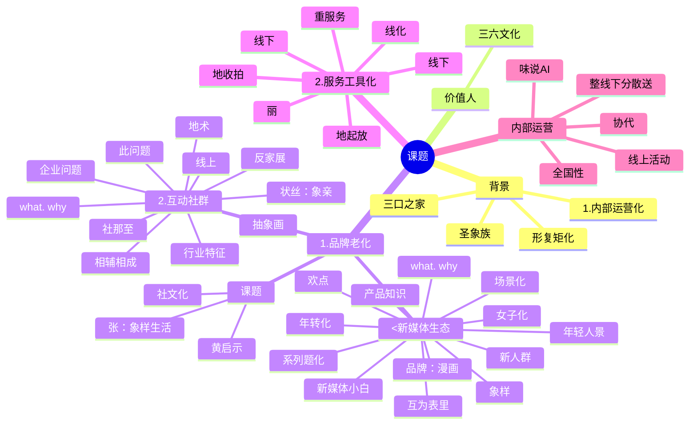

# 640.jpeg 思维导图（Mermaid 格式）

```mermaid
mindmap
  root((课题))
    背景
      1.内部运营化
      形复矩化
      圣象族
      三口之家
    价值人
      三六文化
    1.品牌老化
      <新媒体生态
        what. why
        品牌：漫画
        年转化
        系列题化
        欢点
        新媒体小白
        女子化
        新人群
        年轻人景
        产品知识
        场景化
        象样
        互为表里
      课题
        黄启示
        社文化
        张：象样生活
      2.互动社群
        反家展
        相辅相成
        企业问题
        状丝：象亲
        what. why
        行业特征
        此问题
        线上
        地术
        社那至
        抽象画
    2.服务工具化
      重服务
      丽
      地收拍
      线下
      地起放
      线下
      线化
    内部运营
      协代
      全国性
      整线下分散送
      线上活动
      味说AI
```
